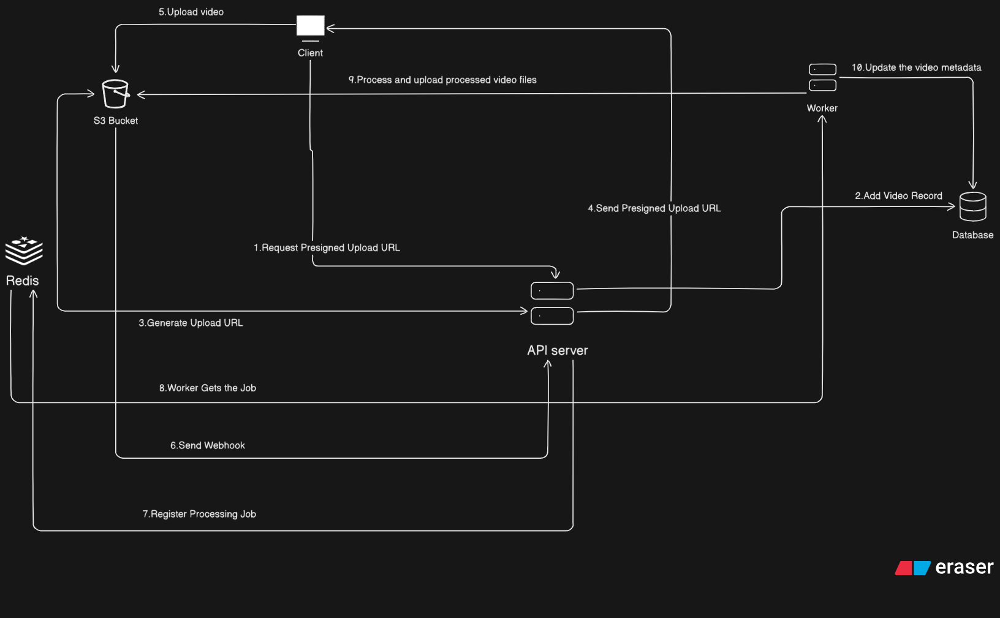

# StreamCore — Open Source Video Backend
[](LICENSE)
[](https://nodejs.org/)
[](https://nestjs.com/)

StreamCore is a **modular, open-source video backend** for uploading, transcoding, streaming, and analytics.  
It supports chunked uploads, adaptive streaming, queue-based processing (BullMQ), and integrates with S3-compatible storage.

The system is designed to be **scalable, modular, and contributor-friendly**.

## StreamCore Architecture

StreamCore is a **modular video backend** designed to handle video uploads, processing, storage, and delivery efficiently.  

### Components

| Component | Responsibility |
|-----------|----------------|
| **API Service** | Handles authentication, video upload/download endpoints, and communicates with other services. |
| **Queue System (Redis + BullMQ)** | Manages asynchronous jobs, primarily video processing tasks. |
| **S3 Service** | Object storage for original and processed videos. |
| **Database (MongoDB)** | Stores video metadata, user info, and job statuses. |
| **Worker Service** | Listens to the queue and performs heavy video processing (transcoding, thumbnails, etc.) using FFmpeg. |

---

### Flow of a Video Upload

1. User uploads a video to the **API Service**.  
2. **API Service** validates the request and stores metadata in the **Database**.  
3. Video file is uploaded to **S3**.  
4. **API Service** pushes a processing job to the **Redis Queue**.  
5. **Worker Service** picks up the job, processes the video (transcoding, thumbnails), and updates **S3** and **Database**.  
6. Processed video becomes available via API endpoints.

---

### Architecture Diagram



## Tech Stack

- **Backend:** NestJS  
- **Database:** MongoDB  
- **Queue & Messaging:** BullMQ, Redis  
- **Storage:** S3-compatible (MinIO, AWS S3)  
- **Video Processing:** FFmpeg  
- **API Docs:** Swagger (Integrated)

## Features

- Chunked video uploads
- Video transcoding via FFmpeg
- Adaptive streaming
- Queue-based processing with BullMQ
- REST API for all services
- Swagger API documentation
- Modular microservice architecture

## Installation

### Clone the repo
```bash
git clone https://github.com/abdurrehman-26/streamcore.git
cd streamcore
```

### Copy and Edit Environment File

```bash
cp .env.example .env
```

Update values (MongoDB URI, Redis, JWT secrets, S3 credentials, etc.)


### Install Dependencies & Run the API Server

```bash
npm install
npm run start:dev
```

Server will start on [http://localhost:3000](http://localhost:3000)

### Start Video Processing Worker

```bash
npm run start:dev video-processing-worker
````

---
## License

This project is licensed under the Apache 2.0 License - see the [LICENSE](LICENSE) file for details.